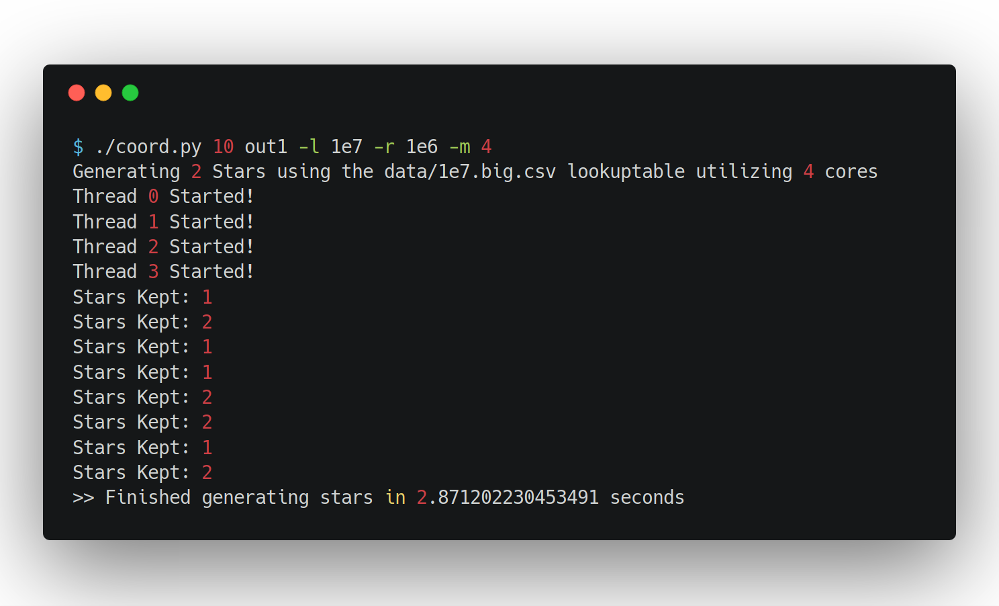

# Python Source Code

### Step 1: Generating a lookuptable

### Step 2: Generate the Coordinates

### Examples:

Generate 10 Stars, save their coordinates in stars/out1.csv. Use the lookuptable
1e7.csv. Generate the coordinates in a range 1e6 aroud the center of the galaxy.
Utilize 4 threads. 

